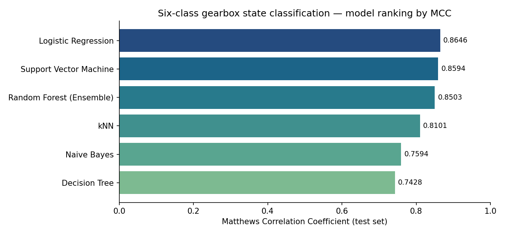
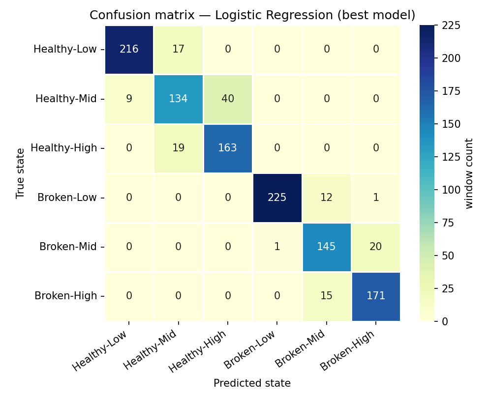

# Wind-Turbine Gearbox Health Explorer

**Machine Learning — Assignment 2**
BITS Pilani WILP · M.Tech (AI/ML) · AIMLCZG565 Machine Learning

Six classification models trained on vibration data from a wind-turbine gearbox
test rig, served through an interactive Streamlit application.

| | |
|---|---|
| **Live Streamlit app** | [Open the deployed app](PASTE-YOUR-STREAMLIT-APP-URL-HERE) |
| **GitHub repository** | [github.com/nirajkmr007/ML-sem1-assignment-2](https://github.com/nirajkmr007/ML-sem1-assignment-2) |

---

## a. Problem statement

Gearbox failures are among the most expensive faults in a wind turbine: a single
gearbox replacement means a crane, a multi-day outage and a six-figure bill.
Condition monitoring systems (CMS) therefore watch gearbox vibration
continuously and try to flag damage long before it becomes a failure.

Two things make this hard in practice:

1. **Vibration amplitude depends on load as much as on damage.** The same gearbox
   produces very different signatures at 10 % and 90 % load, so an alarm
   threshold that works at low load produces false alarms at high load. CMS
   alarm limits are therefore *load-scheduled*.
2. **The load channel is not always trustworthy.** A CMS box is often a separate
   unit from the SCADA system; the load signal can be missing, delayed, or out
   of sync with the vibration buffer it is supposed to annotate.

This project asks whether a classical machine learning model can recover **both**
pieces of context from the raw vibration signature alone:

> Given a short window of gearbox vibration, can we identify **the health state
> of the gear teeth** *and* **the load regime the machine was running at**,
> without access to any SCADA channel?

The target therefore has **six classes** — the combination of two health states
and three load regimes:

| | Low load (0–30 %) | Mid load (40–60 %) | High load (70–90 %) |
|---|---|---|---|
| **Healthy gearbox** | `Healthy-Low` | `Healthy-Mid` | `Healthy-High` |
| **Broken tooth** | `Broken-Low` | `Broken-Mid` | `Broken-High` |

### Why not simply "healthy vs. broken"?

That was tried first and it is **saturated** on this dataset — all six models
score essentially 100 %:

| Model | Accuracy on the binary health-only task |
|---|---|
| Logistic Regression | 1.0000 |
| Decision Tree | 1.0000 |
| kNN | 0.9992 |
| Naive Bayes | 1.0000 |
| Random Forest | 1.0000 |
| Support Vector Machine | 1.0000 |

The healthy and broken-tooth recordings were captured in separate acquisition
campaigns whose overall vibration levels barely overlap, so a single RMS feature
already separates them. A comparison table of six identical `1.0000` rows would
say nothing about the models, so this project targets the harder — and
operationally more interesting — six-class problem. The binary result is
reproduced by `model/train_models.py` on every run and is shown inside the app.

---

## b. Dataset description

**Source:** *Gearbox Fault Diagnosis Data* — vibration recordings from a
SpectraQuest wind-turbine gearbox fault-diagnostics rig.
Kaggle: <https://www.kaggle.com/datasets/brjapon/gearbox-fault-diagnosis> ·
Original release: <https://github.com/Gearboxdata/Gear-Box-Fault-Diagnosis-Data-Set>

### Raw recordings

| Property | Value |
|---|---|
| Recordings | 20 files (10 healthy, 10 broken tooth) |
| Sensors | 4 accelerometers, mounted in four directions |
| Input shaft speed | 30 Hz |
| Load settings | 0 %, 10 %, … 90 % (10 levels per condition) |
| Raw samples | 2,021,119 across all files |

The raw files are continuous time series — a single acceleration sample carries
no information about gear health, so it cannot be fed to a classifier directly.
As in any real CMS pipeline, the stream is cut into short windows and each
window is reduced to a vector of **health indicators**.

### Modelling dataset (what the models actually see)

| Property | Value |
|---|---|
| **Instances (windows)** | **3,941** — comfortably above the 500 minimum |
| **Features** | **36** — comfortably above the 12 minimum |
| Window length | 512 samples, **non-overlapping** |
| Classes | 6 (see table above), roughly balanced (554–788 windows each) |
| Train / test | 2,753 / 1,188 windows |
| Missing values | none |

The 36 features are **9 descriptors × 4 accelerometer channels**. Each descriptor
is a standard rotating-machinery diagnostic indicator:

| Descriptor | Formula / meaning | Why a CMS engineer looks at it |
|---|---|---|
| `rms` | root mean square | overall vibration energy — wear, looseness |
| `p2p` | max − min | severity of the largest impact in the window |
| `kurtosis` | 4th standardised moment | impulsiveness — a chipped tooth strikes once per revolution |
| `skewness` | 3rd standardised moment | waveform asymmetry |
| `crest_factor` | peak ÷ rms | classic early-damage indicator |
| `shape_factor` | rms ÷ mean\|x\| | drift in waveform shape |
| `impulse_factor` | peak ÷ mean\|x\| | impulsive content relative to average level |
| `spec_centroid` | spectral centre of mass | energy migrating to higher frequencies |
| `hf_ratio` | power above ¼ Nyquist ÷ total | high-frequency excitation share |

Columns are named `<channel>_<descriptor>`, e.g. `a1_kurtosis`, `a3_crest_factor`.

Spectral features are expressed in **normalised frequency** (fraction of
Nyquist) because the vendor never published the exact sampling rate for this
dataset — an assumption-free choice that keeps the features valid regardless.

A full exploration of the dataset — raw waveforms and spectra, feature
distributions, the correlation structure, class separability and the data-quality
checks — is in **`model/gearbox_eda.ipynb`**. Every design decision below traces
back to something observed there.

### Two deliberate design decisions

**1 · The load percentage is not a feature.** `load_pct` would leak the load
regime straight into the label. The models see vibration descriptors only.

**2 · The split is chronological, not random.** The last 30 % of *each*
recording is held out; the first 70 % is used for training. A random split would
scatter neighbouring windows from the same recording across both partitions.
Those windows are near-duplicates, so every model would score close to 100 % and
the comparison table would again be meaningless. Holding out a contiguous later
stretch is the honest analogue of *"train on the history you have, deploy on
what comes next"* — which is exactly how a CMS model is used in the field.

### Files in this repository

The project lives in the `wind-gearbox-fault-classification/` folder at the root
of the repository:

```
wind-gearbox-fault-classification/
├── app.py                          Streamlit application
├── requirements.txt                runtime dependencies
├── README.md                       this file
├── test_data.csv                   held-out test set (1,188 windows × 36 features + label)
├── train_data.csv                  training set (2,753 windows) — also the app's retrain fallback
├── assets/                         figures used in this README
└── model/
    ├── feature_extraction.py       raw vibration  ->  36-feature table
    ├── train_models.py             trains + evaluates all six models
    ├── gearbox_eda.ipynb           exploratory data analysis of the dataset
    ├── gearbox_models.ipynb        the modelling workflow, with plots
    └── saved/
        ├── logistic_regression.joblib
        ├── decision_tree.joblib
        ├── knn.joblib
        ├── naive_bayes.joblib
        ├── random_forest_ensemble.joblib
        ├── support_vector_machine.joblib
        ├── comparison_table.csv
        └── metrics.json
```

The raw `.txt` recordings (~108 MB) are **not** committed. To regenerate the
feature CSVs from scratch, download the two zip files from the source repository
above into `data/` and run:

```bash
python model/feature_extraction.py --raw data --outdir .
python model/train_models.py
```

---

## c. Github Repository Link

[https://github.com/nirajkmr007/ML-sem1-assignment-2](https://github.com/nirajkmr007/ML-sem1-assignment-2)

Contains the complete source code, `requirements.txt`, this `README.md`,
`test_data.csv`, and the `model/` folder with all six saved model files plus the
training script and notebook.

---

## d. Models used

All six models are scikit-learn `Pipeline` objects that bundle a
`StandardScaler` with the estimator, so the app can score a freshly uploaded CSV
without having to remember any preprocessing state.

| # | Model | Key settings |
|---|---|---|
| 1 | Logistic Regression | `C=1.0`, `lbfgs`, multinomial, `max_iter=5000` |
| 2 | Decision Tree | `criterion='entropy'`, `max_depth=10`, `min_samples_leaf=5` |
| 3 | k-Nearest Neighbours | `k=7`, distance weighting, Euclidean |
| 4 | Naive Bayes | Gaussian, `var_smoothing=1e-9` |
| 5 | Random Forest (ensemble) | 400 trees, `max_features='sqrt'`, `min_samples_leaf=2` |
| 6 | Support Vector Machine | RBF kernel, `C=10`, `gamma='scale'`, probability enabled |

Hyper-parameters were chosen from the shape of the data (36 standardised
features, ~2.7k training windows, six roughly balanced classes) rather than by
exhaustive grid search, so the comparison reflects each algorithm's inductive
bias rather than how much tuning effort it received.

### Comparison table

Evaluated on the **1,188 held-out test windows**. Precision, Recall and F1 are
macro-averaged (every state counts equally); AUC is the macro one-vs-rest
ROC-AUC.

| ML Model Name | Accuracy | AUC | Precision | Recall | F1 | MCC |
|---|---|---|---|---|---|---|
| Logistic Regression | **0.8872** | **0.9883** | **0.8801** | **0.8822** | **0.8803** | **0.8646** |
| Decision Tree | 0.7862 | 0.9188 | 0.7754 | 0.7756 | 0.7751 | 0.7428 |
| kNN | 0.8418 | 0.9737 | 0.8327 | 0.8349 | 0.8326 | 0.8101 |
| Naive Bayes | 0.7988 | 0.9704 | 0.7900 | 0.7933 | 0.7884 | 0.7594 |
| Random Forest (Ensemble) | 0.8754 | 0.9863 | 0.8672 | 0.8685 | 0.8672 | 0.8503 |
| Support Vector Machine | 0.8830 | 0.9882 | 0.8752 | 0.8760 | 0.8748 | 0.8594 |



### The single most important result

Across all six models and all 1,188 test windows, **the health state is
essentially never confused**. Counting misclassifications that cross the
Healthy ↔ Broken boundary:

| Model | Total errors | of which cross the health boundary |
|---|---|---|
| Logistic Regression | 134 | **0** |
| Decision Tree | 254 | **0** |
| kNN | 188 | **1** |
| Naive Bayes | 239 | **0** |
| Random Forest | 148 | **0** |
| Support Vector Machine | 139 | **0** |

Every point of accuracy lost in the table above is a **load-regime** confusion
(`Healthy-Mid` predicted as `Healthy-High`, and so on), never a missed fault.
From a condition monitoring standpoint this is the ideal failure mode: the
system may be unsure which operating point a reading came from, but it does not
mistake a damaged gearbox for a healthy one.



### Observations on model performance

| ML Model Name | Observation about model performance |
|---|---|
| **Logistic Regression** | The best model on this dataset (Accuracy 0.8872, MCC 0.8646) — a genuinely surprising result for a linear model on vibration data. It works because the 36 descriptors are already the non-linear part: RMS, kurtosis and crest factor are engineered summaries, and load regime turns out to be close to *monotonic* in several of them (RMS climbs steadily from 3.5 to 5.3 as load goes 0 → 90 %). A linear decision boundary in that space is a good match, and with 2,753 samples over 36 features there is little room to overfit. Its AUC of 0.9883 shows the probabilities are well ordered even where the hard prediction is wrong. |
| **Decision Tree** | Weakest model overall (Accuracy 0.7862, MCC 0.7428), and by far the weakest on AUC (0.9188). A single tree splits on one feature at a time with axis-parallel cuts, but the load boundaries are gradual and spread across all four channels — no single threshold cleanly separates "Mid" from "High". Depth was capped at 10 with `min_samples_leaf=5`; deeper trees fit the training windows better but generalised worse across the chronological split. The low AUC reflects a structural limitation: a tree emits coarse, piecewise-constant leaf probabilities, so its ranking of borderline windows is poor even when its top-1 prediction is right. |
| **kNN** | Middle of the pack (Accuracy 0.8418, MCC 0.8101). Distance-weighted voting over 7 neighbours in 36 standardised dimensions suffers mildly from the curse of dimensionality — with all features on equal footing, uninformative descriptors dilute the distance metric. It is also the only model that made a health-boundary error (1 window), because a nearest-neighbour vote has no global notion of the class structure. It would likely improve with feature selection or a learned metric, but was left untuned for a fair comparison. |
| **Naive Bayes** | Second weakest on accuracy (0.7988, MCC 0.7594) but with a strong AUC of 0.9704 — a revealing gap. The conditional-independence assumption is badly violated here by construction: `rms`, `p2p`, `crest_factor`, `shape_factor` and `impulse_factor` are all algebraically derived from the same peak and mean-absolute values, so the model effectively counts the same evidence five times. That miscalibrates the posteriors and pushes hard predictions over the wrong boundary, yet the *ranking* of windows stays sensible, which is exactly what a high AUC with a low accuracy looks like. |
| **Random Forest (Ensemble)** | Strong and reliable (Accuracy 0.8754, MCC 0.8503) — third overall, and a 9-point MCC gain over the single Decision Tree it is built from, which is a textbook demonstration of variance reduction through bagging plus random feature subsampling. It did not overtake the linear models: the ensemble is still made of axis-parallel splits, so it approximates the smooth, correlated load gradient with many small steps rather than one clean boundary. It needed no tuning to get there, which is its practical advantage. |
| **Support Vector Machine** | Effectively tied with Logistic Regression for first place (Accuracy 0.8830, MCC 0.8594, AUC 0.9882). The RBF kernel with `C=10` can bend the boundary where the load regimes overlap, but the fact that it does not beat a linear model confirms the geometry is already close to linearly separable after feature extraction and standardisation. It is by far the slowest of the six to fit and needs `probability=True` (internal cross-validation) to produce the scores the AUC and ROC curves require — a real cost for a marginal gain. |
| **Overall Winner for your dataset?** | **Logistic Regression** — highest score on all six metrics (Accuracy 0.8872, AUC 0.9883, Precision 0.8801, Recall 0.8822, F1 0.8803, MCC 0.8646), while also being the fastest to train, the smallest to store and the only model whose coefficients can be read directly as per-channel sensitivities. Support Vector Machine is statistically indistinguishable from it (a 0.4-point accuracy gap on 1,188 windows) and Random Forest is close behind; if the feature set were expanded or the classes made less balanced, the ensemble would be the safer default. For *this* dataset, the simplest model wins — the hard work was done in the feature extraction stage, not the classifier. |

---

## Streamlit app features

| Requirement | Where it is implemented |
|---|---|
| Dataset upload option (CSV) | Sidebar → *Test data* → **Upload my own CSV**. Validates the 36 feature columns and names exactly which are missing; a **download button supplies the sample test CSV** so the feature can be exercised without leaving the app |
| Model selection dropdown | Sidebar → *Model* → six trained classifiers, each with a one-line note on how it works |
| Display of evaluation metrics | **Selected model** tab — Accuracy, AUC, Precision, Recall, F1, MCC as metric cards, each with a hover explanation and the gap to the best of the six models |
| Confusion matrix / classification report | **Selected model** tab — annotated 6×6 heatmap (raw or row-normalised, downloadable as PNG) *and* the full per-class classification report |

Beyond the required four:

- **Fault detection reliability panel** — collapses the six states to
  *damaged or not* and reports faults caught, false alarms and health-level
  errors. This surfaces the key finding (below) directly in the UI rather than
  burying it in the README.
- **All six models** tab — every model scored on the same data in one
  colour-graded table, a rank-by-any-metric bar chart, a CSV download, and a
  breakdown splitting each model's errors into *cross health boundary* versus
  *load-regime confusion*.
- **Per-window inspector** — pick any window and see the model's probability
  across all six states, its confidence, its second guess, and the raw feature
  values behind the prediction.
- One-vs-rest **ROC curves** per class; class-balance chart of whatever data is
  loaded; per-window prediction table with a correct/incorrect flag, a
  *mistakes only* filter, and a CSV download.
- **Startup resilience** — if the `.joblib` files cannot be unpickled because the
  deployment environment has a different scikit-learn build, the app silently
  retrains from `train_data.csv` instead of showing an error page.

### Running it locally

```bash
git clone https://github.com/nirajkmr007/ML-sem1-assignment-2.git
cd ML-sem1-assignment-2/wind-gearbox-fault-classification
pip install -r requirements.txt
streamlit run app.py
```

Then open the `localhost` URL that Streamlit prints.

---

## Reproducibility

Every result in this README is regenerated by:

```bash
python model/feature_extraction.py --raw data --outdir .   # ~11 s
python model/train_models.py                               # ~10 s
```

`random_state=17` is fixed throughout (feature-table shuffling, the tree,
the forest and the SVM), so the numbers above reproduce exactly.

---

## Acknowledgement of tool use

Python, scikit-learn, pandas, NumPy, matplotlib, seaborn and Streamlit were used
throughout. The dataset is the publicly released SpectraQuest gearbox
fault-diagnosis recording set, linked above. The problem formulation, feature
design, evaluation protocol, model configuration, application and all analysis
in this README are my own work for this assignment.
